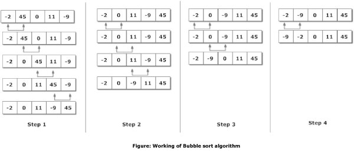

## T10. Comparison of sorting algorithms

<br>

[toc]

### Analysis

#### question background

Sorting algorithm is an algorithm that puts elements of an array in a certain order, and they are used frequently on various occasions.

An efficient sorting algorithm can boost the running time of the programs. Since it's so important and basic in the computer world, it deserves to be studied, and in this way, a lot of sorting algorithms were born, including `BubbleSort`, `SelectionSort`, `InsertionSort`, `ShellSort`, `QuickSort`, `HeapSort`, `MergeSort`, `RadixSort` and so on. Some of them are easy to code but difficult to comprehend, while some are time-savings but may waste extra space...

This problem is like a summarize of these mainstream sort methods. No data structure are used in these sort algorithms except `HeapSort`, so this is more like a problem in an algorithm lesson.


#### functional analysis

Our purpose is clear: put elements of an array in a certain order. And we have several methods to attain this target, these methods are the sort algorithms. What we need to do is to write a main function to call the sorting fucntions and the specific content of these sorting functions.


### Design

#### sort algorithm design

Generally, the sort function will pass in at least the array that need to be sorted as a parameter. In most condition, the scale of array is anather parameter.

Since the size of traditional array is fixed, which will make it inconvenient for later operations. So I use vector from STL to intead of traditional array, in this way, `#inlcude <vector.h>` should be added in the head.

In each sort functions, we want the interval and the swap times. For getting the interval, `GetTickCount()` function can be used to mark the start and end time. Besides that, we have to use `DWORD time_start, time_end;` to declare these viables. As for swap times, just define it as zero, when the swap procss hapenning, time increasement 1.

#### data structure design

The data structure we will use is the max-heap. As we have realized min-heap before, the thing we need to do is to change a few functions of the min-heap structure. I will explain it later in HeapSort part.


#### systematic design

The systematic fucntions are formed by sort algorithm functions, sort auxiliary functions and main function. The core part of this problem is the realization of sort functions.

Most sorting function pass in the vector, size and the swap_tims as the arguments, some pass in other things like left position, right position, in these sorting functions, the random vector will be sorted to an ascending vector.

As for main function, it will firstly define a vector that stored by random numbers, then use a switch grammar to call these different sorting algorithms.

### Realization

#### BubbleSort

BubbleSort is quite simple, the main thought of BubbleSort is always comparing two adjacent numbers, if the left one is larger than the right one, swap them. In this way, after a recycle, the biggest number will be bubbling to the last place, so the next recycle just need to sort the first n-1 numbers.

After i times loops, this array will be sorted in order. The inner substance, I think, of BubbleSort is making the largest one always bubbling to the end in one loop. Since this process is just like bubbles rising to the top, that's why it got this name.


The detailed process of BubbleSort is like this:

<center>



<br>

</center>

And this gif depicts the macroscopical transformation when using BubbleSort to sort an array.

<br>

<center>


</center>

<br>

And the code is not complex:

```C++
void BubbleSort(vector<int>& B, int n, int& compare_times) {
	for (int i = 0; i < n - 1; i++) {
		for (int j = 0; j < n - 1 - i; j++) {
			compare_times++;
			if (B[j] > B[j + 1])
				swap(B[j], B[j + 1]);
		}
	}
}
```
As this algorithm uses doubly nested loops, it's apparently to know the time complexity of BubbleSort is O(n<sup>2</sup>), which means that its efficiency is insufficient.

Since the swap process only happen between the adjacent elements, we can conclude that BubbleSort is a stable sort.

<br>

#### SelectionSort

Selection sort is another sorting algorithm, unlike BubbleSort, SelectionSort is an unstable sort, but their ideology are similar.

It's quite easy to explain the thought of SelectionSort, `traverse the array`->`find the largest element`->`put it in the end`, and at the next time, find the largest element except the previous one and put it to the penult position, and next time, find the largest element in the remain part and put it in the third from the end... Finally after n-1 times finding and placing, the array will be ordered.

<br>

The detailed process of SelectionSort is like this:

<center>


<br>

</center>

This gif depicts the macroscopical transformation when using SelectionSort to sort an array.


<center>

<br>


</center>

<br>

The realization of SelectionSort:

```C++
void SelectionSort(vector<int>& B, int n, int& swap_times) {
	for (int i = 0; i < n; i++) {
		int min = i;
		for (int j = i + 1; j < n; j++) {
			if (B[j] < B[min]) {
				swap_times++;
				min = j;
			}
		}
		swap(B[i], B[min]);
	}
}
```

<br>

#### InsertionSort

In Insertion Sort, the previous list is always sorted. The element need to be inserted in this sorted previous list. What we should do, is to find the right place and insert it there, that's InsertionSort gets its name.

Here are the steps of InsertionSort:

Firstly, The first element is already sorted, we just need to pick next element. Then comparing it with all elements in the previous orted list Step, and finding the proper position and insert the element. Finally, Repeat this process until we operate the last element, that means the list is sorted


This gif shows a example of InsertionSort:
<center>


</center>

And This gif depicts the macroscopical transformation when using InsertionSort to sort an array.

<center>

<br>


</center>

The code of InsertionSort:

```C++
void InsertionSort(vector<int>& B, int n, int& swap_times) {
	int temp;
	for (int i = 1; i < n; i++) {
		temp = B[i];
		for (int j = i - 1; j >= 0; j--) {
			// j==0 means the element is the smallest
			if (j == 0) {
				B[j] = temp;
			}
			// move the element to its next position
			if (temp < B[j]) {
				B[j+1] = B[j];
				swap_times++;
			}
			else {
				B[j + 1] = temp;
				break;
			}
		}
	}
}
```

<br>


#### ShellSort

ShellSort uses a interval to sort elements, the number of elements it sorts at one time is much less than the whole scale. In fact, the subsequence is divided from the former sequence by a interval number.

ShellSort can be regarded as a method to divide the sequence, in fact, the part of each sorting process is based on insertion sort. But this algorithm is quite efficient for large data sets, much better than InsertionSort.

Here are the detailed steps of ShellSort: Firstly Initialize the value of `gap`, then divide the list into smaller sub-sequence among which interval is the size of `gap`. After the partition work, sort these sub-lists using insertionSort. Finally, Repeat this process until gap < 1, which means the list is sortedcompletely.

<br>
<center>


</center>
<br>

```C++
void ShellSort(vector<int>& B, int n, int& swap_times) {
	int gap = (int)(n / 2);
	while (gap) {
		for (int i = gap; i < n; i++) {
			for (int j = i; j >= gap && B[j] < B[j - gap]; j -= gap) {
				swap(B[j], B[j - gap]);
				swap_times++;
			}
		}
		gap = gap == 2 ? 1 : (int)(gap / 2.2);
	}
}
```

<br>

#### QuickSort


QuickSort is the most widely used sorting method. It serves as a systematic method for sorting the elements of an array. owing to its good efficient ( it's an O(nlogn) sorting algorithm )

The steps of QuickSort are: Firstly, Pick an element called a pivot from the array. Then make partion operation, this will use an auxiliary function, the process of partition function is to order the array by this rule: elements less than the pivot come before the pivot, while elements greater than the pivot come after it. Finally recursively calling itself and this array will be ordered

<center>


</center>

This gif depict the process of QuickSort:

<center>


</center>

```C++
void QuickSort(vector<int>& B, const int left, const int right, int& swap_times) {

	if (left < right) {
		int pivotPos = left;
		int pivot = B[left];
		for (int i = left + 1; i <= right; i++) {
			if (B[i] < pivot) {
				pivotPos++;
				if (pivotPos != i) {
					swap(B[pivotPos], B[i]);
					swap_times++;
				}
			}
		}
		B[left] = B[pivotPos];
		B[pivotPos] = pivot;
		QuickSort(B, left, pivotPos - 1, swap_times);
		QuickSort(B, pivotPos + 1, right, swap_times);
	}
}
```

#### HeapSort

HeapSort will use a max-heap as an auxiliary data structure. In fact, using a min-heap can also deal with the problem and more easy to comprehend, however, it will cost extra space while using max-heap will save that space.

In T7 we have realized the min-heap, now it should be changed into a max-heap. The modification we need to is just change some operators in `siftDown()`:

```C++
void Heap::siftDown(int start, int end) {
	int temp = heap[start];
	int i = start;
	int j = 2 * i + 1;
	while (j <= end) {
		// let j become the larger one
		if (heap[j] < heap[j + 1] && j < end)
			j++;
		if (temp >= heap[j])
			break;
		else {
			heap[i] = heap[j];
			i = j;
			j = 2 * j + 1;
		}
	}
	heap[i] = temp;
}
```

(Other parts is almost the same as min-heap)

This gif depict the process of HeapSort:

<center>


</center>


With the help of max-heap, the sort process can be easier.

The thought of HeapSort is: firstly store the elements in a max-heap, then swap the first element(the largest on) and the last element, decrese the capacity and use `siftDown` to mantain the max-heap. After n times swaps, the array will be in order.


```C++
Heap::Heap(vector<int>& A, int size) {
	heap = new int[size];
	if (heap == NULL) {
		cerr << "内存分配失败" << endl;
		exit(1);
	}
	for (int i = 0; i < size; i++) {
		heap[i] = A[i];
	}
	currentSize = size;
	// find the fisrt place that need to adjust
	int currentPos = (currentSize - 2) / 2;
	while (currentPos >= 0) {
		siftDown(currentPos, currentSize - 1);
		currentPos--;
	}
}
```

<br>

#### MergeSort

MergeSort is also a widely used soring algorithm, it's efficient and the thought is quite easy to understand: sorting several sub-lists and merge them to a larger one.

The detailed steps of a merge sort: Firstly, divide the list into n pieces of sublists, in this way, each list contains one element (sorted already) Then merge two sublists to a larger sorted sublists. Repeatly execute this operation until there is only one list left.

Here is a simple example of MergeSort:
<center>


</center>

<br>

This gif depict the process of HeapSort:

<center>


</center>

The merge function is the auxiliary function, it passes in two sorted list, and merge them to be one:

```C++
void merge(vector<int>& L1, vector<int>& L2, const int left, const int mid, \
	const int right, int& compare_times) {
	// L1[left:mid] and L1[mid+1:right]
	for (int i = left; i <= right; i++) {
		L2[i] = L1[i];
	}
	int s1 = left;
	int s2 = mid + 1;
	int t = left;
	while (s1 <= mid && s2 <= right) {
		if (L2[s1] <= L2[s2]) {
			L1[t++] = L2[s1++];
			compare_times++;
		}
		else {
			L1[t++] = L2[s2++];
		}
	}
	while (s1 <= mid) {
		L1[t++] = L2[s1++];
	}
	while (s2 <= right) {
		L1[t++] = L2[s2++];
	}
}
```

MergeSort uses the recursion thought.

```C++
void HeapSort(vector<int>& B, int size, int& swap_times) {
	Heap maxHeap = Heap(B, size);
	for (int i = size - 1; i > 0; i--) {
		maxHeap.swap(0, i);
		swap_times++;
		maxHeap.siftDown(0, i - 1);
	}
}
```

<br>

####  RadixSort

The thought of RadixSort is quite different from the normal sorting algorithms, comparing to other sorting methods, RadixSort is more efficient. The thought of RadixSort is to sort by a radix at one time, for numbers, the radix is 10. In each turn, sorting the specific radix, next time, sort by 10*radix, loop this process untill the highest order is sorted. In this way, we need the `MaxBit` function to help us get the largest order from the radom vector.

Here is an example of RadixSort:

<center>


</center>


<br>

And the code of `RadixSort` and the auxiliary function `MaxBit`:

```C++

// get the highest order of the largest figure
int MaxBit(vector<int> B, int n) {
	int max = B[0];
	for (int i = 1; i < n; i++ ) {
		if (max < B[i]) {
			max = B[i];
		}
	}
	int d = 1;
	int p = 10;
	while (max >= p) {
		max = max / 10;
		d++;
	}
	return d;
}
```

```C++
void RadixSort( vector<int>& B, int size, int& swap_times) {
	int d = MaxBit(B, size);
	int* temp = new int[size];
	int count[10];
	// the radix which will be sorted by this
	int radix = 1;
	// make d times sorts
	for (int i = 1; i <= d; i++) {
		//empty the counter before each sorting
		for (int j = 0; j < 10; j++) {
			count[j] = 0;
		}
		for (int j = 0; j < size; j++) {
			int k = (B[j] / radix) % 10;
			count[k]++;
		}
		for (int j = 1; j < 10; j++) {
			count[j] = count[j - 1] + count[j];
		}
		// using temp[] to store the elements
		for (int j = size - 1; j >= 0; j--) {
			int k = (B[j] / radix) % 10;
			temp[count[k] - 1] = B[j];
			count[k]--;
		}
		for (int j = 0; j < size; j++) {
			B[j] = temp[j];
		}
		radix *= 10;
	}
}

```

<br>

#### Main function

Mian function's function is to generate random numbers to create a vector and make a switch menu for the user to choose a sorting method. Since I use the vector structure from STL, just using `push_back` to add the random element to the vector.

Besides, I add a regular expression method to judge whether the number user input is valid, only positive interger lower than 10000 is accepted.


```C++
bool isPositiveInterger(string s)
{
	//compile a Regex pattern to match the positive intergers
	regex pattern("^(\\+)?(\\d+)$");
	if (regex_match(s, pattern)) {
		return true;
	}
	else
		return false;
}
```

```C++
int checkInput(string input, int& num) {
	if (!isPositiveInterger(input)) {
		cout << "请输入正整数";
		return 0;
	}
	num = stoi(input);
	if (num > 100000 || num == 0) {
		cout << "个数请介于1-100000之间";
		return 0;
	}
	return 1;
}
```


```C++
int main()
{
	/*
	print the menu(omit here)
	*/
	string input;
	int num;
	int loop = 1;
	while (loop) {
		cout << "请输入要产生随机数的个数: ";
		cin >> input;
		// input number is not proper
		if (!checkInput(input, num)) {
			cout << endl << endl;
		}
		else {
			loop = 0;
		}
	}
	srand((unsigned)time(NULL));
	for (int i = 0; i < num; i++) {
		int item = rand();
		A.push_back(item);
	}
	/*
	for (int i = 0; i < num; i++) {
		cout << A[i] << ' ';
	}
	*/
	loop = 1;
	vector<int> B, C;
	long long swap_times, compare_times;
	while (loop) {
		cout << endl << "请选择排序算法：";
		int id;
		cin >> id;
		DWORD time_start, time_end;
		switch (id) {
		case 1:
			B = copyVector(num);
			swap_times = 0;
			time_start = GetTickCount();
			BubbleSort(B, num, swap_times);
			time_end = GetTickCount();
			cout << "冒泡排序所用时间：" << (time_end - time_start) << "ms" << endl;
			cout << "冒泡排序交换次数：" << swap_times << endl;
			break;
		case 2:
			B = copyVector(num);
			swap_times = 0;
			time_start = GetTickCount();
			SelectionSort(B, num, swap_times);
			time_end = GetTickCount();
			cout << "选择排序所用时间：" << (time_end - time_start) << "ms" << endl;
			cout << "选择排序交换次数：" << swap_times << endl;
			break;
		case 3:
			B = copyVector(num);
			swap_times = 0;
			time_start = GetTickCount();
			InsertionSort(B, num, swap_times);
			time_end = GetTickCount();
			cout << "直接插入排序所用时间：" << (time_end - time_start) << "ms" << endl;
			cout << "直接插入排序交换次数：" << swap_times << endl;
			break;
		case 4:
			B = copyVector(num);
			swap_times = 0;
			time_start = GetTickCount();
			ShellSort(B, num, swap_times);
			time_end = GetTickCount();
			cout << "希尔排序所用时间：" << (time_end - time_start) << "ms" << endl;
			cout << "希尔排序交换次数：" << swap_times << endl;
			break;
		case 5:
			B = copyVector(num);
			//DWORD time_start, time_end;
			swap_times = 0;
			time_start = GetTickCount();
			QuickSort(B, 0, num-1, swap_times);
			time_end = GetTickCount();
			cout << "快速排序所用时间：" << (time_end - time_start) << "ms" << endl;
			cout << "快速排序交换次数：" << swap_times << endl;
			break;
		case 6:
			B = copyVector(num);
			//DWORD time_start, time_end;
			swap_times = 0;
			time_start = GetTickCount();
			HeapSort(B, num, swap_times);
			time_end = GetTickCount();
			cout << "堆排序所用时间：" << (time_end - time_start) << "ms" << endl;
			cout << "堆排序交换次数：" << swap_times << endl;
			break;
		case 7:
			B = copyVector(num);
			C = copyVector(num);
			//DWORD time_start, time_end;
			compare_times = 0;
			time_start = GetTickCount();
			MergeSort(B, C, 0, num-1, compare_times);
			time_end = GetTickCount();
			cout << "归并排序所用时间：" << (time_end - time_start) << "ms" << endl;
			cout << "归并排序比较次数：" << compare_times << endl;
			break;
		case 8:
			B = copyVector(num);
			//DWORD time_start, time_end;
			swap_times = 0;
			time_start = GetTickCount();
			RadixSort(B, num, compare_times);
			time_end = GetTickCount();
			cout << "基数排序所用时间：" << (time_end - time_start) << "ms" << endl;
			cout << "基数排序交换次数：" << swap_times << endl;
			break;
		case 9:
			loop = 0;
			break;
		}
	}
	system("pause");
}
```

<br>

### Test

#### general condition

##### 100 numbers:


##### 1000 numbers:


##### 10000 numbers:


##### 100000 numbers:

#### input number is not proper

`not a positive interger` or `number larger than 100000`


### Conclusion

Having realizing these sorting algorithms, we can make comparations among them. Here is the theoretical analysis of time complexity among these sorint algorithms:

<table>
<thead>
<tr>
<td style="text-align: center"><strong>Algorithm</strong></td>
<td style="text-align: center" colspan="3"><strong>Time Complexity</strong></td>
</tr>
<tr>
<td></td>
<td><strong>Best</strong></td>
<td><strong>Average</strong></td>
<td><strong>Worst</strong></td>
<td></td>
</tr>
</thead>
<tbody>
<tr>
<td>Bubble Sort</a></td>
<td>Ω(n)</td>
<td>θ(n^2)</td>
<td>O(n^2)</td>
</tr>
<tr>
<td>Selection Sort</a></td>
<td>Ω(n^2)</td>
<td>θ(n^2)</td>
<td>O(n^2)</td>
</tr>
<tr>
<td>Insertion Sort</a></td>
<td>Ω(n)</td>
<td>θ(n^2)</td>
<td>O(n^2)</td>
</tr>
<tr>
<td>Shell Sort</a></td>
<td>Ω(n log(n))</td>
<td>depend on gap</td>
<td>O(n^2)</td>
</tr>
<tr>
<td>Quick Sort</a></td>
<td>Ω(n log(n))</td>
<td>θ(n log(n))</td>
<td>O(n^2)</td>
</tr>
<tr>
<td>Heap Sort</a></td>
<td>Ω(n log(n))</td>
<td>θ(n log(n))</td>
<td>O(n log(n))</td>
</tr>
<tr>
<td>Merge Sort</a></td>
<td>Ω(n log(n))</td>
<td>θ(n log(n))</td>
<td>O(n log(n))</td>
</tr>
<tr>
<td>Radix Sort</td>
<td>Ω(nk)</td>
<td>θ(nk)</td>
<td>O(nk)</td>
</tr>
</tbody>
</table>

In the actual practise,The running time is almost the same as theoretical analysis, besides that, we can also find some other useful conclusions.

When the amount is not large, it seems that most sorting algorithms cost  similar period of time. However, when the amount reach a level, the difference between these algorithms are apparently: `BubbleSort` cost the longest time, while `Selection Sort` and `Insertion Sort` snap at its heels. The time these three spend is much more longer than the rest.

`Shell Sort`, `Heap Sort`, `Quick Sort` and `Merge Sort` perform well even the amount is quite large, and they just spend dozens of milliseconds to sort 100000 random numbers.

As for their differences, `Shell Sort`'s performance depend on the gap it use, while `Heap Sort` need to defien a max-heap and the swap times are high. `Quick Sort` is easy to realize with fewer time, I think that's why it was chosed as systematic sorting algorithm. `Radix Sort` is really quick without comparing, it's a great method while the elements are not very big numbers, but it will be quite complex to realize while the elements that need to be sorted are strings or other items.
