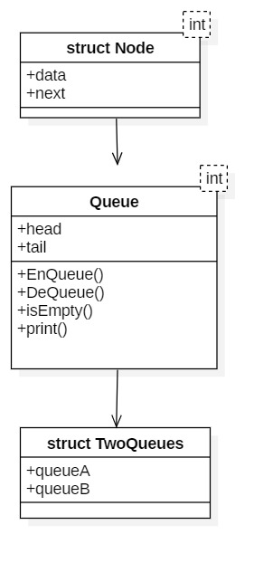
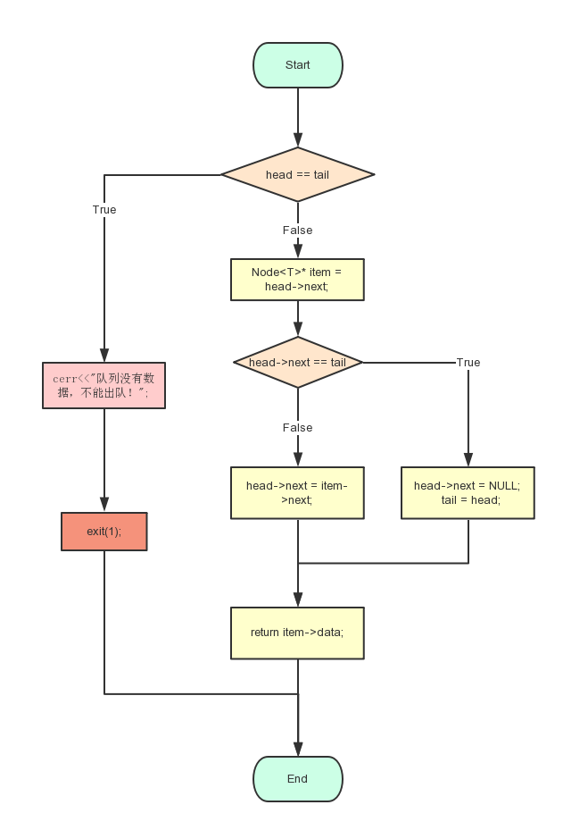
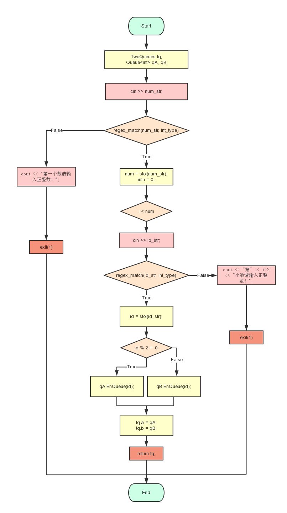
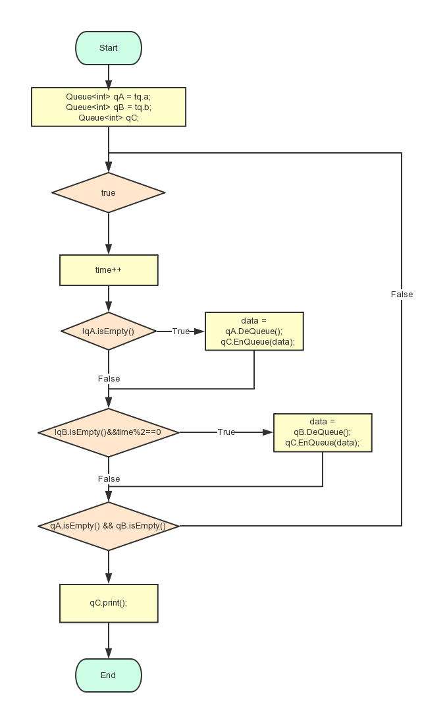
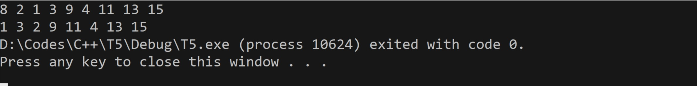
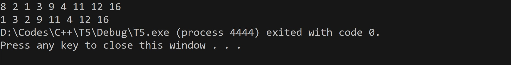
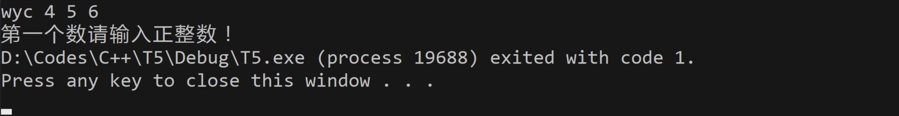
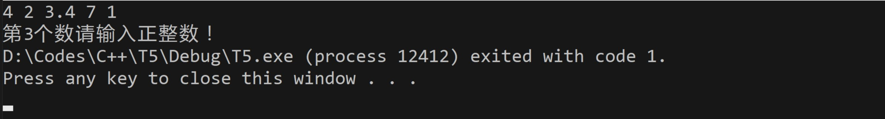

## T5. Banking Bussinese

[toc]

### Analysis

#### question background

Queue is a common thing in our daily life. Banking bussinese is a good example: the number of waiting people is much bigger than the number of windows. In order to ensure fairness, we ought to follow FIFO(First-in-First-out) principle, and that's the reason why we nees to use queue to solve lining-up problems.

In addition, the efficiency of each window is totally diffrent, by using queue, we can realize better scheduling, which will reduce the waiting time.

#### functional analysis

To realize the specific queue solution, we need firstly eastablish queue structure. Importing from STL is a way, but building up our own queue structure is much better.

The `Queue` class **at least** need to own these two functions: `EnQueue()`, `DeQueue()`, and two member variables: `*head` and `*tail`.

Here are the details.

<br>

### Design

#### data structure design

This question shows that `N <= 1000`, using array to deal with this problem is kind of awkward. And it will involve a lot of insert and delete operations. So using linked list is a better choice.

And as usual, an extra head node is added, which will make manipulation functions more concise.
<br>
#### class structure and system design

Before designing the `Queue` class, it's essential to definit a node structure, since it doesn't contains many factors, using `struct Node` is enough.


```C++
/* Node */
// generalization is not not a must
template <typename T>
struct Node {
  // constructor with no parameter
    Node(Node<T>* ptr = NULL) { next = ptr; }
  // constructor overload
    Node(const T& d, Node<T>* ptr = NULL) { data = d; next = ptr; }
  // two member variables
    T data;
    Node<T>* next;
};
```

Then the `Queue` class:

```C++
/* Queue */
template <typename T>
class Queue
{
public:
    Queue() {
        head = new Node<T>();
        tail = head;
    }
    void EnQueue(T d);
    T DeQueue();
    bool isEmpty() { return head == tail; }
    void print();
private:
    Node<T>* head;
    Node<T>* tail;
};
```

In core system, I decide to use costom `IstreamFun()` and `OstreamFun()`, the former is to convert the input to two queues(queueA and queueB),  the latter will receive these two queues, do come calculates and output the result.

In order to make `IstreamFun()` function be able to return two queues, I add another structure(named `TwoQueues`) to reserve two queues.

```C++
/* TwoQueues */
// it's quite simple
struct TwoQueues {
    Queue<int> a;
    Queue<int> b;
};
```

So the final structure is this:

<center>
    
</center>

#### operation design

`Node`
```C++
// Node constructor
Node(Node<T>* ptr = NULL) { next = ptr; }
// overload constructor
Node(const T& d, Node<T>* ptr = NULL) { data = d; next = ptr; }
// data means the number that queue saved
T data;
// *next point, link to the next element
Node<T>* next;
```
<br>

`Queue`

```C++
/* public members */
// constructor
Queue() {
    head = new Node<T>();
    tail = head;
}
// destructor
~Queue();
// enqueue operation, the node will be insert to the tail
void EnQueue(T d);
// dequeue operation, the first node will be poped out
T DeQueue();
// determine if it's empty
bool isEmpty() { return head == tail; }
// output the queue according to the format
void print();
```

```C++
/* private members */
// the head pointer, pointing to a blank node, head->next is the first item
Node<T>* head;
// the tail pointer, pointing to the last node
Node<T>* tail;
```
<br>

#### systematic design

The systematic core functions are these:
```C++
TwoQueues IstreamFun()
void OstreamFun(TwoQueues tq)
```

<br>

### Realization

#### Enqueue()

enqueue operation is quite simple, just make the new node to be the next node of tail pointer.

```C++
template<typename T>
void Queue<T>::EnQueue(T d)
{
	Node<T>* item = new Node<T>(d);
	tail->next = item;
	item->next = NULL;
	tail = item;
}
```
<br>

#### Dequeue()

Dequeue operation is a little complex than enqueue, firstly it need to judge whether the queue is empty, then the circumstance that the queue only has one element.

<center>
    
</center>

```C++
template<typename T>
T Queue<T>::DeQueue()
{
	if (head == tail) {
		cerr<<"队列没有数据，不能出队！";
		exit(1);
	}
	Node<T>* item = head->next;
	// only one element in the queue
	if (head->next == tail) {
		head->next = NULL;
		tail = head;
	}
	else {
		head->next = item->next;
	}
	return item->data;
}
```
<br>

`print()`
```C++
template<typename T>
void Queue<T>::print()
{
	Node<T>* item = head->next;
	while (item->next != NULL) {
		cout << item->data << " ";
		item = item->next;
	}
	// avoid the last blank
	cout << item->data;
}
```
<br>

#### IstreamFun

IstreamFun() is used to transport input message to the queue. In this function, it returns a structure `TwoQueues`, in order to storing two queues by calling one function.

And it use `regex_match` to judge whether the input string is a int type or not. If it's not a figure, it will trigger an alert message and exit(1).

<center>
    
</center>

```C++
TwoQueues IstreamFun()
{
	TwoQueues tq;
	Queue<int> qA, qB;
	string num_str, id_str;
	int num, id;
	cin >> num_str;mdp
	if (!regex_match(num_str, int_type)) {
		cout << "第一个数请输入正整数！";
		exit(1);
	}
	num = stoi(num_str);
	for (int i = 0; i < num; i++) {
		cin >> id_str;
		if (!regex_match(id_str, int_type)) {
			cout << "第" << i+2 << "个数请输入正整数！";
			exit(1);
		}
		id = stoi(id_str);
		if (id % 2 != 0) {
			qA.EnQueue(id);
		}
		else
			qB.EnQueue(id);
	}
	tq.a = qA;
	tq.b = qB;
	return tq;
}
```
<br>

#### OstreamFun

OstreamFun is used to output the correct order, it pass in a `TwoQueues` structure, which contains two queues. Using a `while(true)` or `for(;;)` circulation to simulate time.

<center>
    
</center>

```C++
void OstreamFun(TwoQueues tq)
{
	Queue<int> qA = tq.a;     
	Queue<int> qB = tq.b;
	//qC is used to print(just make the code more perceptual)
	Queue<int> qC;
	int data;
	int time = 0;
	for (; ; ) {
		++time;
		if (!qA.isEmpty()) {
			data = qA.DeQueue();
			qC.EnQueue(data);
		}
		if(!qB.isEmpty()&&time%2==0) {
			data = qB.DeQueue();
			qC.EnQueue(data);
		}
		if (qA.isEmpty() && qB.isEmpty())
			break;
	}
	qC.print();
}

```

<br>

#### main function
 main function just need to call these two functions:

 ```C++
 int main()
{
	TwoQueues t = IstreamFun();
	OstreamFun(t);
}
 ```

<br>

### Test

#### Normal test (window A has more people)

`Input`:
`8 2 1 3 9 4 11 13 15`

`Expected Result`:
`1 3 2 9 11 4 13 15`

`Actual Result`:



<br>

#### Normal test (window B has more people)

`Input`:
`8 2 1 3 9 4 11 12 16`

`Expected Result`:
`1 3 2 9 11 4 12 16`

`Actual Result`:



<br>

#### N = 1

`Input`:
`1 6`

`Expected Result`:
`6`

`Actual Result`:


<br>

#### First number is not a int type

`Input`:
`2.3 3 5`

`Expected Result`:
`show error information`

`Actual Result`:


<br>

<br>

`Input`:
`wyc 456`

`Expected Result`:
`show error information`

`Actual Result`:




<br>

#### Following number is not a int type

`Input`:
`4 2 3.4 7 1`

`Expected Result`:
`show error information`

`Actual Result`:



<br>
